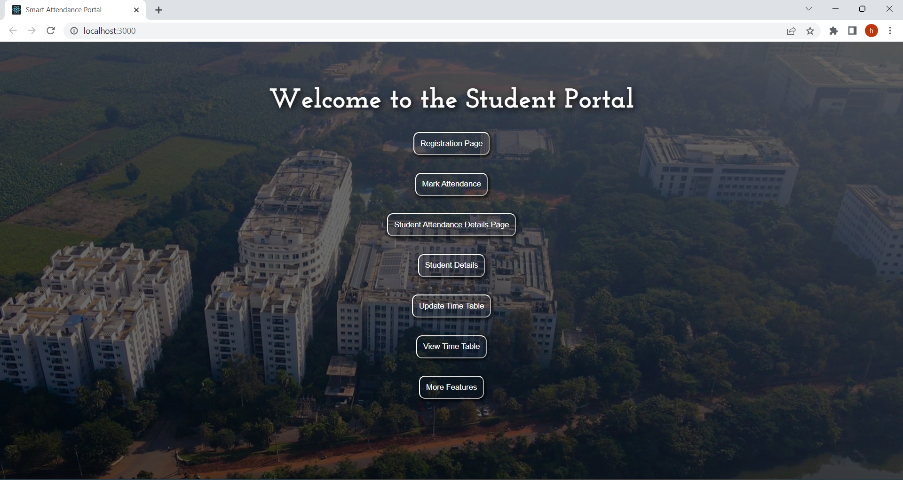
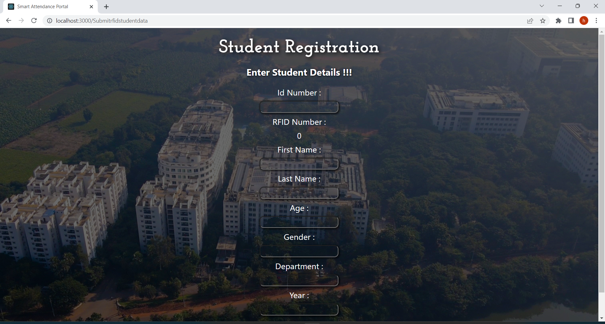
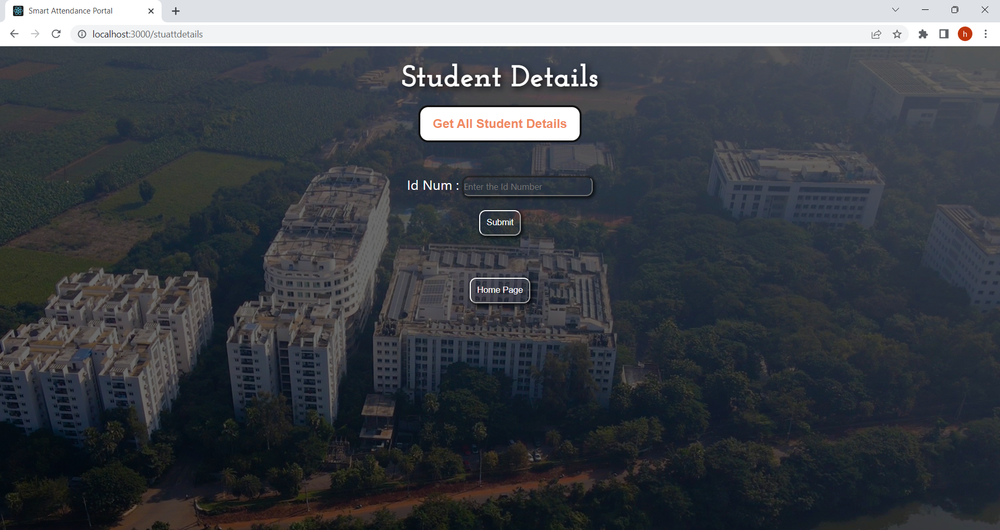

# IoT-enabled Student Attendance Tracking  

## 📘 Project Overview  
This project automates the student attendance process using **ESP-32** and **RFID** technology. The **ESP-32** reads student RFID tags, sends the data to a **Node.js server** via **MQTT**, and the server processes the data based on the timetable to mark attendance. The system uses **MySQL** to store attendance data, and the data can be viewed and managed via a **React.js** web interface, all running in **Docker** containers on the cloud.

The system was tested with a department of **1190 students**, achieving **95% accuracy** in attendance tracking.

## 🔧 Technologies Used  
- **Hardware**:  
  - **ESP-32**  
  - **RFID Module**  
  - **Required Board**  
- **Software**:  
  - **Languages**: JavaScript (Node.js), React.js  
  - **Communication**: MQTT, HTTP API  
  - **Database**: MySQL  
  - **Cloud Deployment**: Docker  
  - **Protocol**: MQTT running on GCC for communication between ESP-32 and server  

## 🚀 Key Features  
- **RFID-based Attendance**: Attendance is recorded when students scan their RFID tags with the ESP-32.
- **Real-Time Processing**: The ESP-32 sends data to the **Node.js server** via MQTT, which processes attendance in real-time.
- **Web Interface**: A **React.js** web interface allows administrators to view attendance data and manage student records.
- **MySQL Integration**: Attendance data is stored and managed in a **MySQL** database for efficient tracking and reporting.
- **Cloud Deployment**: The entire system is deployed in **Docker containers** on the cloud, enabling scalability and remote access.
- **Tested at Scale**: The system was tested with **1190 students** from a department, achieving an **accuracy of 95%**.

## 🔨 Installation & Setup  
1. **Hardware Setup**:  
   - Connect the **RFID module** to the **ESP-32**.
   - Set up the **ESP-32** with the necessary board and program it to read RFID tags.

2. **Software Setup**:  
   - Clone the repository:  
     ```bash
     git clone https://github.com/khemanthvijay/IoT-Student-Attendance.git
     ```  
   - Install dependencies for **Node.js** and **React.js**:
     ```bash
     npm install
     ```

3. **Run the System in Docker**:  
   - Build and run the Docker containers for the server and web interface:
     ```bash
     docker-compose up
     ```

4. **Database Setup**:  
   - Make sure the **MySQL** database is set up and running, as the attendance data will be stored here.

5. **Web Interface**:  
   - Access the web interface at `http://<server-ip>:3000` to view attendance records and manage the system.

## 📸 Screenshots  
#Student Attendance Dashboard

#Student Registration Page

#Student Details

## 🏆 Future Improvements  
- **Mobile App**: Develop a mobile app to allow students to check their attendance and interact with the system.
- **Cloud Scalability**: Integrate with cloud services like **AWS** or **Google Firebase** for better scalability and access.
- **Advanced Features**: Add advanced reporting and notifications for administrators.

## 📄 License  
This project is licensed under the MIT License - see the [LICENSE](LICENSE) file for details.
